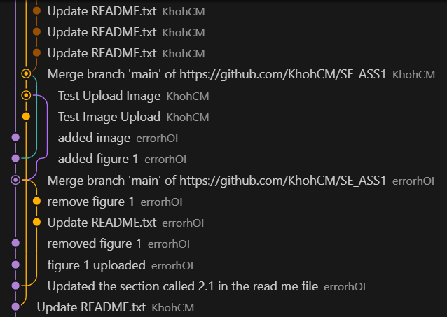

## 1.0 Project Introduction

In this report, our group decided to discuss the idea and explore various types of algorithms in
the Rock-Paper-Scissors game. Through this activity, our group decided to implement the
concept of “Artificial Intelligence” where participants engaged in a game with a computer
instead of real players to demonstrate both competitors' abilities in using various algorithmic
strategies. The main goal of this task and in this report will be discussed ,was to conduct an
engaging game that highlighted the core algorithmic concepts or characteristics which includes
time complexity, space complexity and adaptive algorithms that were engaging for participants.

Each team member has made efforts in the respective fields. Wen Han was in charge of writing the code, which made sure the game's basic logic and functionality worked.  In order to make the game both visually appealing and easy to use, Tharsshen and Li Xian concentrated on creating the user interface.  Throughout the development process, Char Meng contributed to both strategy and execution, offering invaluable help and support. We collaborated to develop a system that is not only useful but also enticing and instructive for users.

## 2.0 System Development & Features

## 2.1 System Logic
As stated in the introduction section, the system's gameplay that this project has decided to developed, participants will play a classic Rock-Paper-Scissors game  against a computer opponent that is programmed to adapt its choices based on the participant’s previous moves. By using a simple pattern-recognition algorithm, the computer will adjust its  responses creating a dynamic and strategic challenge where players must try to “outsmart” the system. The game provides a fun and engaging way to explore basic concepts in terms of  prediction and machine learning algorithm. For this project development, we will use “Python” a programming language, accompanied by several libraries to develop, libraries include, cvzone’s  “HandTrackingModule” for object tracking , pygame and cv2 a computer vision library for image processing which includes detecting objects and tracking motion. The system takes the input of the player through a camera and pass the input through the library cv2 handtracking module which not only invloves in object tracking but classification towards the object has been detected or tracked where the module tracks based on the interjoints of a person's hand or the player's hand in this senario, and determine the types of gestures that the user has preformed. Moving forward after the system takes the number of interjoints that has been detected by using handtracking module, the system will perfom a mapping technique which will be represented or be mapped into 0 and 1 for classification task  with 0,0,0,0,0 (represented as 5 fingers ) a single array with the variable of “1”  which will be  “Rock”, paper will have an array of 1,1,1,1,1 which will be represent with the variable of  “2”  and 0,1,1,0,0 will be scissors with the variable of 3. Lastly  the system will take  the output values of the mapping and will impliment it through a if else condition or a form of rule based condition. which will be represented as (Figure 1).

  
  
<em>Figure 1: Game Logic Flow</em>

## 2.2 System features and technology used

For the system's features, this project has decided to categorize into 3 enhancements corresponding with the current issues of the rock paper sciorss gameplay, and based on brainstorming the ideas we have the defined that the current gameplay consist of several issues such as lack of difficulty variation in certain situation where if hardcore rock paper scissors players wanted to challenge the game they are require to find or search expert players to stay engaged. Next is miminal player feedback, players only provide reaction through facial emotion and basic visual cues, which can lead to boredom and disconnection from the experience and without meaningful feedback or interactive elements, the gameplay can feel repetitive and unengaging. Speaking of unengaging, the gameplay consist of limited engagement, such that traditional rock-paper-scissors games offer little beyond the basic gameplay loop, often lack visual appeal, sound effects, narrative context, or interactive features, thus leading to short-term interest and limited replay value. Therefore to solve the following issues that we have defined, 3 proposed solutions or enhancement for this project was agreed on development and will be represented as through three iterations or were defined as Sprint 1 , Sprint 2 and Sprint 3, with each iteration focusing on specific areas of improvement in terms of the gameplay experience and visulization for users. Starting from the first iteration which involves in core gameplay mechanics , the system includes or offers three 3 difficulty modes which consist of easy, medium and hard with each using different algorithmic strategies, comming in first for easy mode, this mode uses a deterministic and predictable pattern based on varible roundNumber % 3  in the code, thus allowing players to learn and recognize a sequence over time, as for Medium Mode, this mode applies a probabilistic model using Python's random.randint() function to select moves unpredictably, in contrast to hard mode which uses a rule-based conditional system where the system selects the exact counter to the player’s move, guaranteeing a win if input is recognized correctly. For the second iteration,this project decided the system may include a UI thorugh using pygame library for user interface and feedback where the UI consist the output of the system and which will represented as  3 images for visual cues such as an image of a rock , an image of a paper and and image of a scissor. Addtionally, the system will also display the user's hand and face to provide visual feedback and justification towards the detected hand gestures. Lasltly for the third iteration, this project has decided to add features to boost immersion and engagement through including several sound effect such as winning and end phase, thus allowing the players to be more immersive in the game itself, and for further improvement in terms of user engagement, a simple storyline was introduced towards the system as well where players can experience an enhance version of the game rock paper scissor, in consequence transforming it from a basic loop into a more narrative-driven experience, and through storytelling element, it may enable increases in player interest and adds emotional depth to the gameplay. As a side information in terms of technical specification and the libaray that will be used for this project development, a webcam was use for receiving the input, python core programming language for logic and integration, OpenCV (cv2) for image processing and camera feed input, cvzone for hand gesture tracking and classification, pygame for rendering images, text, and sound in the UI, and lastly tkinter and tkvideo library will be used for displaying post-game video and interface elements.

## 3.0 Scrum/Agile Implementation

## 3.1 Product Backlog
Next to manage the development of the Rock-Paper-Scissors AI game efficiently, our team adopted the Agile Scrum methodology and this approach allowed us to divide the project into manageable tasks, prioritize development goals, and track our progress using a Kanban board, and at the begining of the project, we have created a product blocklog that identified all of the essential features and task reqired to complete our project and which were categorized based on functional components of the system such as for sprint 1 will be defined as Core Game Mechanics which include the task hand detection, gesture recognition, and basic GUI for our system, sprint 2 tournament flow and feedback including score tracking, winner declaration, and user layout, sprint 3  game modes and sound effects which include Easy/Medium/Hard modes, sound design, and round counter, and lastly, another sprint will be include as well but not related towards system enhancement which will be defined as "reporting" and encompasses system documentation, version control, and user manual. 

## 3.2 Kanban Board Tracking
As a side note, we utilized a Kanban board as shown in the screenshot to manage and monitor our task progress and the tasks were organized into several columsn such as

- To Do -  which will allocated what we must do first or which function of system we should prioritize
- In Progress - which will show which function of system and task is still in progress 
- Completed - show function of system and task that are completed 
- Report  -  which it will be include table of contents  
- Redo - which will be the task or system that require to redo after some bugs or errors that have beed defined
- Closed  - which will listing out all of the task and system that has been completed

## 3.3 Team Task Distribution
For this project we have decided to conduct task distribution through dicussion on the dates that we were free of external task and who is expert in specific areas in terms of developing system functionality and the system UI. Thus here is the following list corresponding with the dates have we have successfully discuss: 

Core game mechanics
- Implementing webcam hand detection using cvzone (Due: 2025 May 29) - Tharsshen Govikrishnan
-  Detecting hand gestures (Rock, Paper, Scissors) (Due: 2025 June 2) - Tharsshen Govikrishnan
-  Adding a basic background story (Due: 2025 June 3) - Hoi Wen Han
-  Setting up a basic GUI (BG.png) (Due: 2025 June 4) - Hoi Wen Han
-  Allowing game exit using the 'q' key (Due: 2025 June 4) - Tharsshen Govikrishnan, Khoh Char Meng

Tournament Flow + UI
- Tracking and displaying scores over 5 rounds (Due: 2025 June 5) - Hoi Wen Han, Khoh Char Meng
- Declaring the final winner (Player, AI, or Draw) (Due: 2025 June 6)- Khoh Char Meng , Hoi Wen Han
- Aligning player and AI visuals on screen (Due: 2025 June 5)- Hoi Wen Han
- Score display at top left and right of screen (Due: 2025 June 5) - Khoh Char Meng, Hoi Wen Han
- Displaying result: win/loss/draw (Due: 2025 June 6) - Khoh Char Meng , Hoi Wen Han
- Showing themed video using tkvideo (Due: 2025 June 6) - Tharsshen Govikrishnan
- Adding a restart button (via 'r' key) (Due: 2025 June 6) - Khoh Char Meng , Tharsshen Govikrishnan

Game Modes & Engagement
- Creating three difficulty modes (Easy, Medium, Hard) (Due: 2025 June 8) - Tharsshen Govikrishnan, Khoh Char Meng, Hoi Wen Han
- Adding sound effects (Due: 2025 June 9) - Khoh Char Meng, Hoi Wen Han
- Implementing button-based mode selection (Due: 2025 June 11) - Tharsshen Govikrishnan, Hoi Wen Han
- Integrating a round counter (5 rounds = 1 tournament) (Due: 2025 June 11) - Khoh Char Meng,  Tharsshen Govikrishnan

Report
- Project overview (June 14) 
- System development and features (Due: 2025 June 16) - Hoi Wen Han
- Scrum/Kanban Implementation (Due: 2025 June 15) - Hoi Wen Han
- Version control (Due: 2025 June 15)
- User Manual (Due: 2025 June 16)
- Reflection & Conclusion (Due: 2025 June 15)

Project basics 
- open git hub create read me file - Khoh Char Meng
- determine the topic  - Hoi Wen Han , Khoh Char Meng,  Tharsshen Govikrishnan
- create a kanban board for schedule planaing - Hoi Wen Han

Overall Figure 2 will be the complete version of the kanban board using website click up

  
  
<em>Figure 2: Kanban Board</em>

5. Version Control
GitHub served as our collaborative version control tool for this project, which allow us to track and manage the development process.  All team members could review changes, contribute their work, and maintain project organization in this GitHub repository.

We managed every stage of development using commits, branches, and tags in accordance with best practices. 

To record the project's modifications and advancements, commits were made on a regular basis with concise, descriptive remarks.

  
  
<em>Figure 2: GitHub Commits</em>

Branches were created to separate the tasks assigned to each group member, such as UI design, AI algorithm development, and testing.With this strategy, we were able to work simultaneously without restricting each other's contributions.

  
  
<em>Figure 2: GitHub Branches</em>

Screenshots TAGS

We were able to keep an organized workflow, successfully handle disagreements, and preserve the project's whole history by using GitHub for version control.It also made collaboration easier by allowing us to review each other’s code and merge changes smoothly.

6. User Manual
How to run the project
How to interact with it

7. Reflection & Conclusion
Challenges our  group faced 
What we have learned
Improvements

